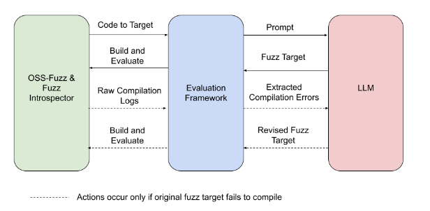

# A Framework for Fuzz Target Generation and Evaluation

This framework generates fuzz targets for real-world `C`/`C++` projects with
various Large Language Models (LLM) and benchmarks them via the
[`OSS-Fuzz` platform](https://github.com/google/oss-fuzz).

More details available in [AI-Powered Fuzzing: Breaking the Bug Hunting Barrier](https://security.googleblog.com/2023/08/ai-powered-fuzzing-breaking-bug-hunting.html):

Current supported models are:
- Vertex AI code-bison
- Vertex AI code-bison-32k
- Gemini Pro
- OpenAI GPT-3.5-turbo
- OpenAI GPT-4

Generated fuzz targets are evaluated with four metrics against the most up-to-date data from production environment:
- Compilability
- Runtime crashes
- Runtime coverage
- Runtime line coverage diff against existing human-written fuzz targets in `OSS-Fuzz`.

Here is a sample experiment result from 2024 Jan 31.
The experiment included [1300+ benchmarks](./benchmark-sets/all) from 297 open-source projects.

Overall, this framework manages to successfully leverage LLMs to generate valid fuzz targets (which generate non-zero coverage increase)
for 160 C/C++ projects. The maximum line coverage increase is 29% from the existing human-written targets.

Note that these reports are not public as they may contain undisclosed vulnerabilities. 

## Usage

Check our detailed [usage guide](./USAGE.md) for instructions on how to run this framework and generate reports based on the results.

## Collaborations
Interested in research or open-source community collaborations?
Please feel free to create an issue or email us: oss-fuzz-team@google.com.

## Bugs Discovered

So far, we have reported 6 new bugs/vulnerabilities found by automatically generated targets built
by this framework:
| Project |    Bug    |    LLM    | Prompt template |
| ------- | --------- | --------- | --------------- |
| [`cJSON`](https://github.com/google/oss-fuzz/tree/master/projects/cjson) | [OOB read](https://github.com/DaveGamble/cJSON/issues/800) | Vertex AI | [default](prompts/template_xml) |
| [`libplist`](https://github.com/google/oss-fuzz/tree/master/projects/libplist) | [OOB read](https://github.com/libimobiledevice/libplist/issues/244) | Vertex AI | [default](prompts/template_xml) |
| [`hunspell`](https://github.com/google/oss-fuzz/tree/master/projects/hunspell) | [OOB read](https://github.com/hunspell/hunspell/issues/996) | Vertex AI | [default](prompts/template_xml) |
| [`zstd`](https://github.com/google/oss-fuzz/tree/master/projects/zstd) | [OOB write](https://bugs.chromium.org/p/oss-fuzz/issues/detail?id=67497) | Vertex AI | [default](prompts/template_xml) |
| Undisclosed | [stack buffer underflow](https://bugs.chromium.org/p/oss-fuzz/issues/detail?id=67483) | Vertex AI | [default](prompts/template_xml) |
| Undisclosed | [use of unitialised memory](https://bugs.chromium.org/p/oss-fuzz/issues/detail?id=67516) | Vertex AI | [default](prompts/template_xml) |

These bugs could only have been discovered with newly generated targets. They were not reachable with existing OSS-Fuzz targets.

## Current top coverage improvements by project

| Project  | Coverage increase % * |
|----------|-------------------|
| tinyxml2 | 29.84 |
| inih | 29.67 |   
| lodepng | 26.21 |
| libarchive | 23.39 |
| cmark | 21.61 | 
| fribidi | 18.20 |    
| lighttpd | 17.56 |
| libmodbus | 16.59 |
| valijson | 16.21 |
| libiec61850 | 13.53 |
| hiredis | 13.50 |
| cmake | 12.62 | 
| pugixml | 12.43 | 
| meshoptimizer | 12.23 |
| libusb | 11.12 | 
| json | 10.84 |

\* Percentage coverage is calculated using a denominator of the total lines of source code compiled during the
OSS-Fuzz build process for the entire project.

## Citing This Work
Please click on the _'Cite this repository'_ button located on the right-hand side of this GitHub page for citation details.
