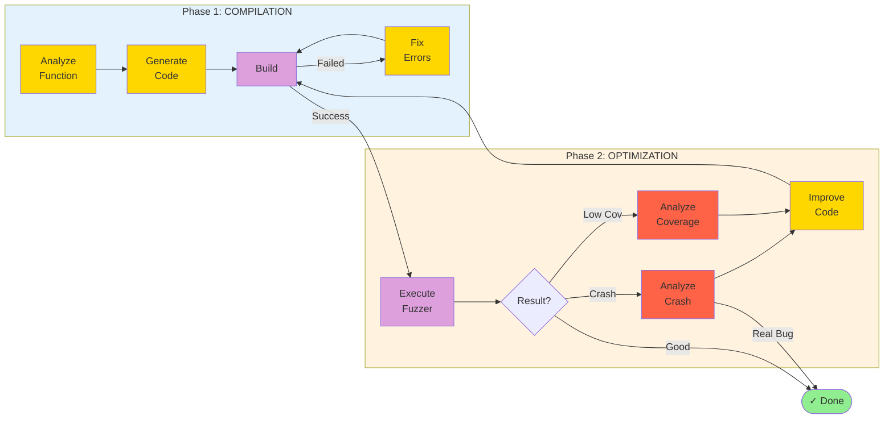

# LogicFuzz

**Automated Fuzz Target Generation using LLM Agents**

LogicFuzz is an intelligent fuzzing framework that leverages Large Language Models (LLMs) to automatically generate high-quality fuzz targets. It uses a **two-phase agentic workflow** to achieve high compilation success rates and maximize code coverage.

---

## 🎯 Key Features

- **🤖 AI-Powered Generation**: Uses LLM agents to analyze functions and generate fuzz targets
- **📊 High Success Rate**: 70-85% compilation success through intelligent error fixing
- **🔄 Iterative Improvement**: Automatically optimizes coverage and discovers real bugs
- **🛡️ Robust Workflow**: Two-phase design with multi-layer protection against failures
- **⚡ Token Efficient**: Optimized prompts with 80% token reduction

**Supported Models:**
- OpenAI GPT (gpt-4, gpt-5)
- Vertex AI Gemini (gemini-2-5-pro-chat)

---

## 🚀 Quick Start

### Basic Usage

```bash
# Run with default settings
python agent_graph/main.py -y conti-benchmark/cjson.yaml --model gpt-5

# Run with specific function
python agent_graph/main.py -y conti-benchmark/cjson.yaml \
  -f cJSON_Parse --model gpt-5

# Run with custom options
python agent_graph/main.py -y conti-benchmark/cjson.yaml \
  --model vertex_ai_gemini-2-5-pro-chat \
  --context --max-iterations 5 --run-timeout 600
```

### Alternative Entry Point

```bash
# Using run_logicfuzz.py (equivalent to above)
python run_logicfuzz.py --agent -y conti-benchmark/cjson.yaml --model gpt-5
```

---

## 📐 Architecture Overview

### Two-Phase Workflow



**Phase 1 (COMPILATION)**: Focus on getting the fuzz target to build
- Analyze target function semantics and constraints
- Generate initial fuzz target with proper setup
- Intelligently fix compilation errors with code context
- Fallback to regeneration if fixing fails

**Phase 2 (OPTIMIZATION)**: Focus on maximizing effectiveness
- Execute fuzzer and collect coverage metrics
- Analyze crashes to distinguish real bugs from false positives
- Suggest and implement coverage improvements
- Iterate until goals achieved or coverage stabilizes

### Agent Components

| Agent | Type | Purpose |
|-------|------|---------|
| **Function Analyzer** | 🟡 LLM | Analyze API semantics, preconditions, constraints |
| **Prototyper** | 🟡 LLM | Generate initial fuzz target and build scripts |
| **Enhancer** | 🟡 LLM | Fix errors and improve code quality |
| **Crash Analyzer** | 🔴 LLM | Classify crash types and severity |
| **Coverage Analyzer** | 🔴 LLM | Suggest coverage improvements |
| **Context Analyzer** | 🔴 LLM | Validate crash feasibility |
| **Build** | 🟣 Non-LLM | Compile fuzz target |
| **Execution** | 🟣 Non-LLM | Run fuzzer and collect metrics |

📖 **For detailed workflow diagrams and implementation details, see [agent_graph/README.md](agent_graph/README.md)**

---

## 📊 Performance Metrics

Recent optimizations have significantly improved the framework's effectiveness:

| Metric | Before | After | Status |
|--------|--------|-------|--------|
| **Compilation Success** | 35% | 70-85% | ✅ Implemented |
| **Token Efficiency** | Baseline | -80% | ✅ Optimized |
| **Coverage Gain** | Baseline | 5-10x | ✅ Enhanced |
| **Workflow Robustness** | Basic | 5-layer protection | ✅ Hardened |

---

## 🔧 System Architecture

```
┌─────────────────────────────────────────────────────────┐
│                   User Entry Points                      │
├─────────────────────────────────────────────────────────┤
│  agent_graph/main.py  or  run_logicfuzz.py --agent     │
└────────────────────┬────────────────────────────────────┘
                     ↓
           ┌─────────────────────┐
           │  run_single_fuzz.py │  (Single source of truth)
           └─────────────────────┘
                     ↓
           ┌─────────────────────┐
           │  LangGraph Workflow │  (State machine)
           └─────────────────────┘
                     ↓
      ┌──────────────┴──────────────┐
      ↓                              ↓
┌──────────┐                  ┌──────────┐
│ LLM Nodes│                  │ Non-LLM  │
│ (Agents) │                  │  Nodes   │
└──────────┘                  └──────────┘
      ↓                              ↓
┌─────────────────────────────────────────┐
│         Standard Result Saving          │
└─────────────────────────────────────────┘
```

**Design Principles:**
- ✅ Single source of truth for workflow execution
- ✅ Consistent result format across all modes
- ✅ Standard file structure and behavior
- ✅ Modular agent design for easy extension

---

## 📁 Project Structure

```
logic-fuzz/
├── agent_graph/           # LangGraph workflow implementation
│   ├── agents/           # Agent base classes
│   ├── nodes/            # Workflow nodes (Function Analyzer, Prototyper, etc.)
│   ├── workflow.py       # State machine definition
│   ├── state.py          # Workflow state management
│   └── main.py           # Entry point
├── conti-benchmark/      # Benchmark YAML files
├── prompts/              # LLM prompt templates
├── experiment/           # Evaluation and metrics
├── report/               # Result analysis and reporting
└── run_logicfuzz.py     # Main runner
```

---

## 📖 Documentation

- **[agent_graph/README.md](agent_graph/README.md)** - Detailed workflow diagrams and state machine
- **[data_prep/README.md](data_prep/README.md)** - Benchmark preparation guide

---

## 🎓 Usage Examples

### Generate for Single Function
```bash
python agent_graph/main.py \
  -y conti-benchmark/libxml2.yaml \
  -f xmlParseDocument \
  --model gpt-5
```

### Batch Processing with Multiple Trials
```bash
python agent_graph/main.py \
  -y conti-benchmark/conti-cmp/mosh.yaml \
  --model gpt-5 \
  -n 5
```

### With Local Fuzz Introspector (FI)

LogicFuzz can leverage **Fuzz Introspector** to provide rich context about target functions, including call graphs, complexity analysis, and reachability information. This significantly improves generation quality.

**Prerequisites:**
1. Set up local Fuzz Introspector server (see [FI documentation](https://github.com/ossf/fuzz-introspector))
2. Ensure FI is running on `http://0.0.0.0:8080/api`

**Run with FI context:**
```bash
python agent_graph/main.py \
  -y conti-benchmark/conti-cmp/mosh.yaml \
  --model gpt-5 \
  -n 5 \
  --context \
  -mr 5 \
  -e http://0.0.0.0:8080/api \
  2>&1 | tee logicfuzz-output-1025-fi.log
```

**Parameters explained:**
- `-n 5` - Generate 5 fuzz targets per function
- `--context` - Enable Fuzz Introspector context retrieval
- `-mr 5` - Maximum retry count (5 attempts)
- `-e http://0.0.0.0:8080/api` - FI endpoint URL
- `2>&1 | tee logicfuzz-output-1025-fi.log` - Log output to file while displaying

**Benefits of using FI:**
- 📊 **Better API Understanding** - Access to function signatures, parameters, and types
- 🔗 **Call Graph Analysis** - Understand function dependencies and relationships
- 🎯 **Targeted Generation** - Focus on complex, high-value functions
- 📈 **Higher Success Rate** - Context-aware code generation reduces errors

### Batch Processing Multiple Projects
```bash
python run_logicfuzz.py \
  --benchmarks-directory conti-benchmark/all \
  --model gpt-5 \
  --num-samples 10
```

---

\* "Total project lines" measures the source code of the project-under-test compiled and linked by the preexisting human-written fuzz targets from OSS-Fuzz.

\* "Total coverage gain" is calculated using a denominator of the "Total project lines". "Total relative gain" is the increase in coverage compared to the old number of covered lines.

\* Additional code from the project-under-test maybe included when compiling the new fuzz targets and result in high percentage gains.
