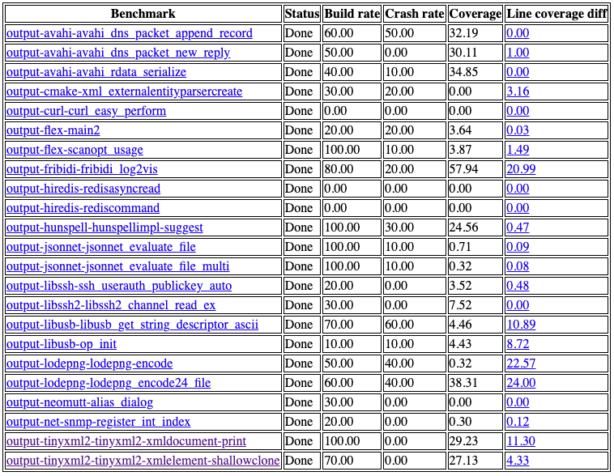

# A Framework for Fuzz Target Generation and Evaluation

This framework generates fuzz targets for real-world `C`/`C++` projects with
Large Language Models (LLM) and benchmarks them via the
[`OSS-Fuzz` platform](https://github.com/google/oss-fuzz).

More details available in [AI-Powered Fuzzing: Breaking the Bug Hunting Barrier](https://security.googleblog.com/2023/08/ai-powered-fuzzing-breaking-bug-hunting.html):

Current supported models are:
- Vertex AI code-bison
- Vertex AI code-bison-32k
- Gemini Pro
- OpenAI GPT-3.5-turbo
- OpenAI GPT-4

Generated fuzz targets are evaluated with four metrics against the most up-to-date data from production environment:
- Compilability
- Runtime crashes
- Runtime coverage
- Runtime line coverage diff against existing human-written fuzz targets in `OSS-Fuzz`.

Here is a sample experiment result from 2024 Jan 22.
The experiment included 23 benchmarks from 15 open-source projects.
It generated 10 fuzz targets with *Vertex AI code-bison-32k* and the [*default template*](prompts/template_xml), then fuzzed them for a one-hour.

Overall, the framework successfully instructed LLM to generate some valid fuzz
targets with non-zero coverage increases for 120 C/C++ projects, with increases
of up to 30% line coverage from the existing human-written targets.

## Usage

Check our detailed [usage guide](./USAGE.md) for instructions on how to run this framework.

## Vulnerabilities Discovered

So far,  we have reported 2 new vulnerabilities found by automatically generated targets built
by this framework:
| Project |    LLM    | Prompt template |
| ------- | --------- | --------------- |
| [`cJSON` ](https://github.com/DaveGamble/cJSON/issues/800) | Vertex AI | [default](prompts/template_xml) |
| [`libplist`](https://github.com/libimobiledevice/libplist/issues/244) | Vertex AI | [default](prompts/template_xml) |

## Collaborations
Interested in research or open-source community collaborations?
Please feel free to create an issue or email us: oss-fuzz@google.com.

