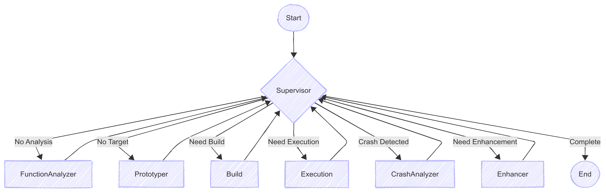
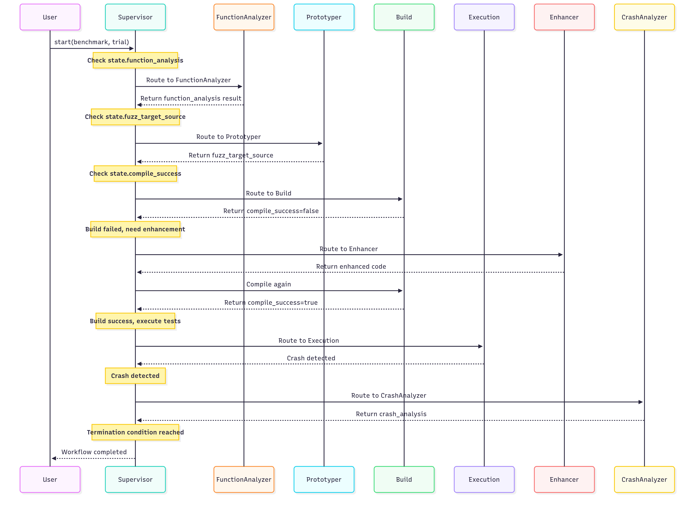

# LogicFuzz


Current supported models are:
- OpenAI GPT

## Overview of our Agentic design




## Detailed workflow of LogicFuzz



## Basic usage

Currently, we just use version 1: non-agent mode to show the effectiveness.

### Agent Mode (LangGraph Implementation)

LogicFuzz supports an agentic mode using LangGraph workflow. All entry points use the same underlying implementation through `run_single_fuzz.py`, ensuring consistent results and behavior.

**Recommended entry (Simple CLI)**
```bash
python agent_graph/main.py -y benchmark.yaml --model gpt-5
```

**Alternative entry (Explicit --agent flag)**
```bash
python run_logicfuzz.py --agent -y benchmark.yaml --model gpt-5
```

Both commands produce identical results. The architecture ensures:
- Single source of truth for workflow execution
- Consistent result format across all modes
- Standard file structure and saving behavior

**Architecture:**
```
agent_graph/main.py  →  run_logicfuzz.py --agent  →  run_single_fuzz.py
                                                     ↓
                                              LangGraph workflow
                                                     ↓
                                              Standard result saving
```

**Example with options:**
```bash
# Run with context and custom iterations
python agent_graph/main.py -y benchmark-sets/0-conti/cjson.yaml \
  -f cJSON_Parse --model vertex_ai_gemini-2-5-pro-chat \
  --context --max-iterations 5 --run-timeout 600
```


-----

\* "Total project lines" measures the source code of the project-under-test compiled and linked by the preexisting human-written fuzz targets from OSS-Fuzz.

\* "Total coverage gain" is calculated using a denominator of the "Total project lines". "Total relative gain" is the increase in coverage compared to the old number of covered lines.

\* Additional code from the project-under-test maybe included when compiling the new fuzz targets and result in high percentage gains.
