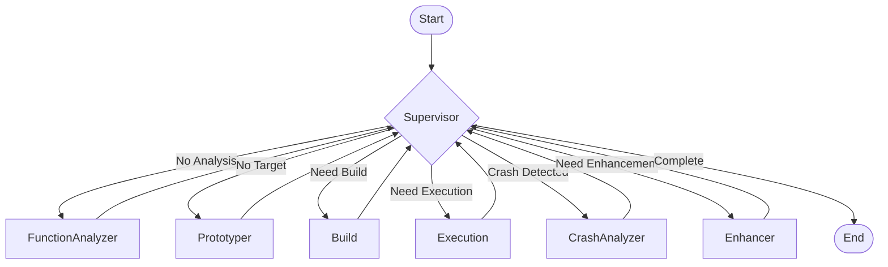
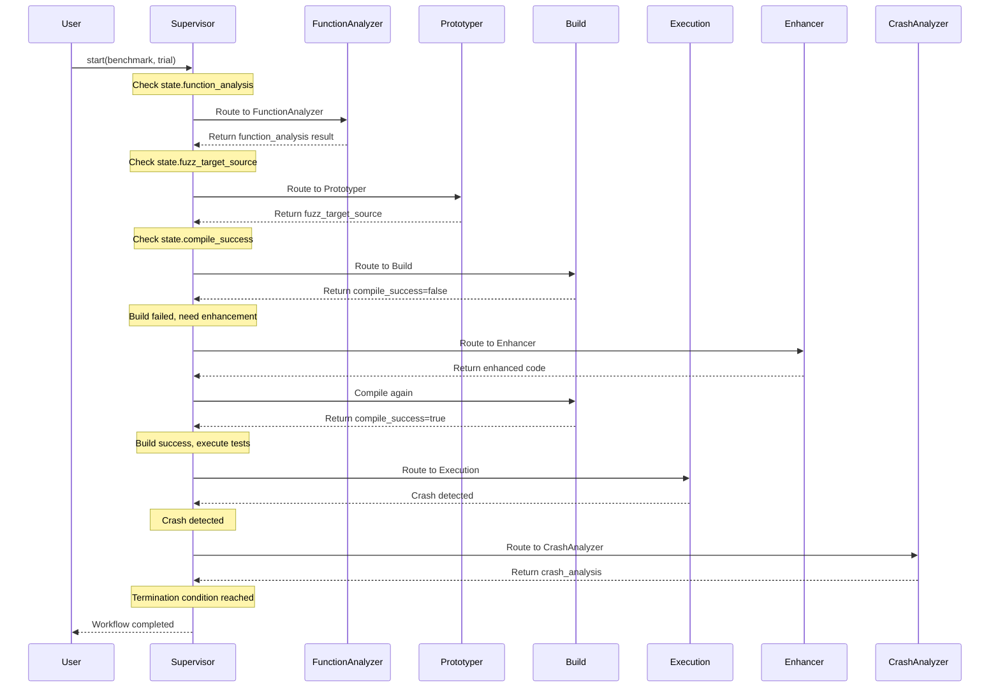

# LangGraph Migration Design

## Core Architecture

Supervisor as central intelligent router with 6 specialized nodes:

```mermaid
graph TD
    START([Start]) --> SUPERVISOR{Supervisor}
    
    SUPERVISOR -->|No Analysis| ANALYZER[FunctionAnalyzer]
    SUPERVISOR -->|No Target| PROTOTYPER[Prototyper]
    SUPERVISOR -->|Need Build| BUILD[Build]
    SUPERVISOR -->|Need Execution| EXECUTION[Execution]
    SUPERVISOR -->|Crash Detected| CRASH[CrashAnalyzer]
    SUPERVISOR -->|Need Enhancement| ENHANCER[Enhancer]
    SUPERVISOR -->|Complete| END([End])
    
    ANALYZER --> SUPERVISOR
    PROTOTYPER --> SUPERVISOR  
    BUILD --> SUPERVISOR
    EXECUTION --> SUPERVISOR
    CRASH --> SUPERVISOR
    ENHANCER --> SUPERVISOR
```

```mermaid
sequenceDiagram
    participant U as User
    participant S as Supervisor
    participant FA as FunctionAnalyzer
    participant P as Prototyper
    participant B as Build
    participant E as Execution
    participant EN as Enhancer
    participant CA as CrashAnalyzer

    U->>S: start(benchmark, trial)
    
    Note over S: Check state.function_analysis
    S->>FA: Route to FunctionAnalyzer
    FA-->>S: Return function_analysis result
    
    Note over S: Check state.fuzz_target_source  
    S->>P: Route to Prototyper
    P-->>S: Return fuzz_target_source
    
    Note over S: Check state.compile_success
    S->>B: Route to Build
    B-->>S: Return compile_success=false
    
    Note over S: Build failed, need enhancement
    S->>EN: Route to Enhancer
    EN-->>S: Return enhanced code
    
    S->>B: Compile again
    B-->>S: Return compile_success=true
    
    Note over S: Build success, execute tests
    S->>E: Route to Execution  
    E-->>S: Crash detected
    
    Note over S: Crash detected
    S->>CA: Route to CrashAnalyzer
    CA-->>S: Return crash_analysis
    
    Note over S: Termination condition reached
    S-->>U: Workflow completed
```