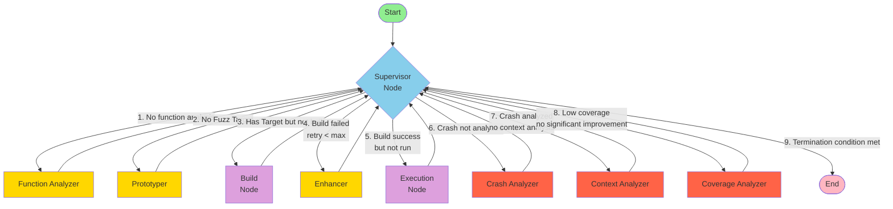
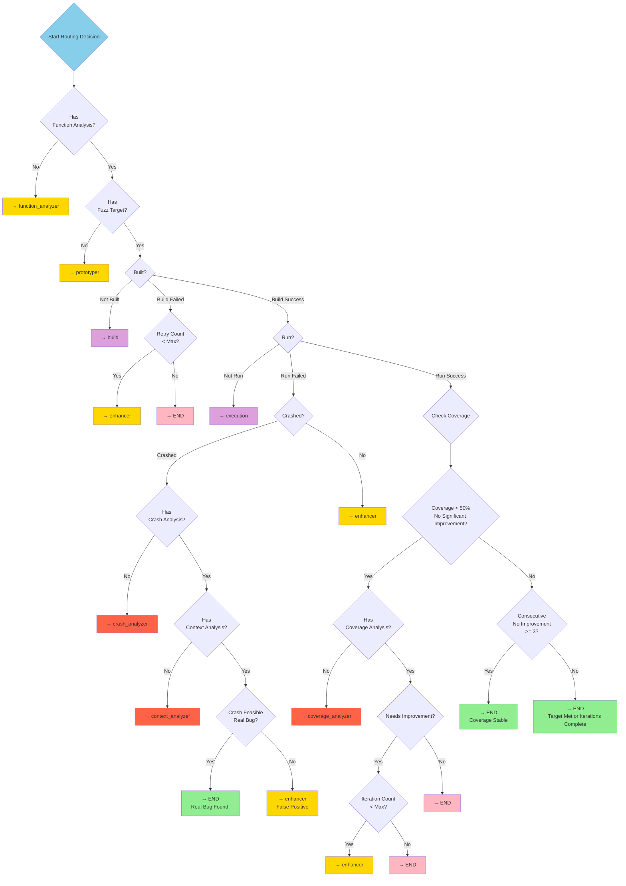
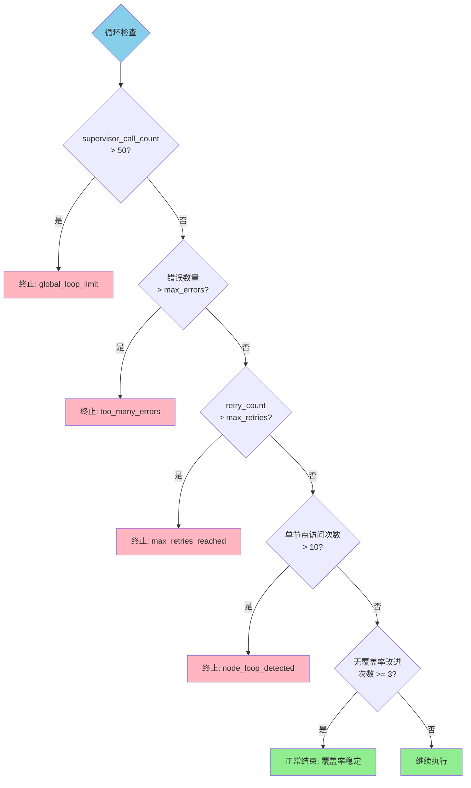
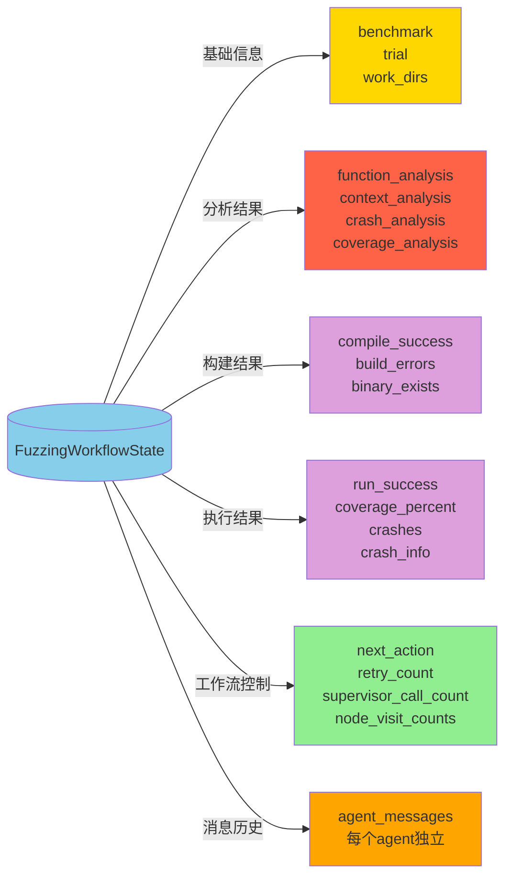

# LangGraph Agent State Machine

## Complete Workflow Diagram



### Core Loop Structure

The workflow follows a **centralized star topology** where all nodes return to Supervisor for next-step decision making:

1. **FunctionAnalyzer** → Supervisor → **Prototyper** → Supervisor → **Build** → Supervisor
2. Build success → **Execution** → Supervisor
3. Build failure → **Enhancer** → Supervisor → Build (retry loop)
4. Crash detected → **CrashAnalyzer** → Supervisor → **ContextAnalyzer** → Supervisor
5. Low coverage → **CoverageAnalyzer** → Supervisor → **Enhancer** → Supervisor (improvement loop)

## State Machine Details

### 1. Node Types

#### Supervisor Node
- **Function**: Decides next action based on current state
- **Input**: Current workflow state
- **Output**: next_action (next node to execute)

#### LLM-Driven Nodes (Using Large Language Models)
- **Function Analyzer**: Analyzes target function, generates function signature and requirements
- **Prototyper**: Generates initial fuzz target and build scripts
- **Enhancer**: Improves fuzz target based on error feedback
- **Crash Analyzer**: Analyzes crash information, determines if it's a real bug
- **Coverage Analyzer**: Analyzes coverage reports, provides improvement suggestions
- **Context Analyzer**: Analyzes crash context, determines feasibility

#### Non-LLM Nodes
- **Build**: Compiles fuzz target
- **Execution**: Runs fuzzer and collects results

### 2. Routing Decision Tree



### 3. 循环控制机制



### 4. 状态数据流



### 5. 典型执行路径

#### 路径1: 成功发现真bug
```
Start → Supervisor → FunctionAnalyzer → Supervisor → Prototyper → 
Supervisor → Build → Supervisor → Execution → Supervisor → 
CrashAnalyzer → Supervisor → ContextAnalyzer → Supervisor → END (真bug!)
```

#### 路径2: 达到良好覆盖率
```
Start → Supervisor → FunctionAnalyzer → Supervisor → Prototyper → 
Supervisor → Build → Supervisor → Execution → Supervisor → 
CoverageAnalyzer → Supervisor → Enhancer → Supervisor → Build → 
Supervisor → Execution → Supervisor → END (覆盖率达标)
```

#### 路径3: 构建失败后修复
```
Start → Supervisor → FunctionAnalyzer → Supervisor → Prototyper → 
Supervisor → Build (失败) → Supervisor → Enhancer → Supervisor → 
Build → Supervisor → Execution → Supervisor → END
```

### 6. 关键配置参数

| 参数 | 默认值 | 说明 |
|------|--------|------|
| MAX_SUPERVISOR_CALLS | 50 | 全局supervisor调用次数上限 |
| MAX_NODE_VISITS | 10 | 单个节点最大访问次数 |
| max_retries | 3 | 最大重试次数 |
| max_errors | 5 | 最大错误数量 |
| NO_IMPROVEMENT_THRESHOLD | 3 | 连续无覆盖率改进次数阈值 |
| COVERAGE_THRESHOLD | 0.5 | 低覆盖率阈值 (50%) |
| IMPROVEMENT_THRESHOLD | 0.01 | 最小改进阈值 (1%) |
| SIGNIFICANT_IMPROVEMENT | 0.05 | 显著改进阈值 (5%) |
| max_iterations | 5 | 最大迭代次数 |

## 图例说明

- 🟢 **绿色**: 开始/成功结束
- 🔵 **蓝色**: Supervisor监督节点
- 🟡 **黄色**: LLM驱动的分析/生成节点
- 🟣 **紫色**: 构建/执行节点（非LLM）
- 🔴 **红色**: 分析节点（崩溃/覆盖率）
- 🔴 **粉色**: 异常终止

