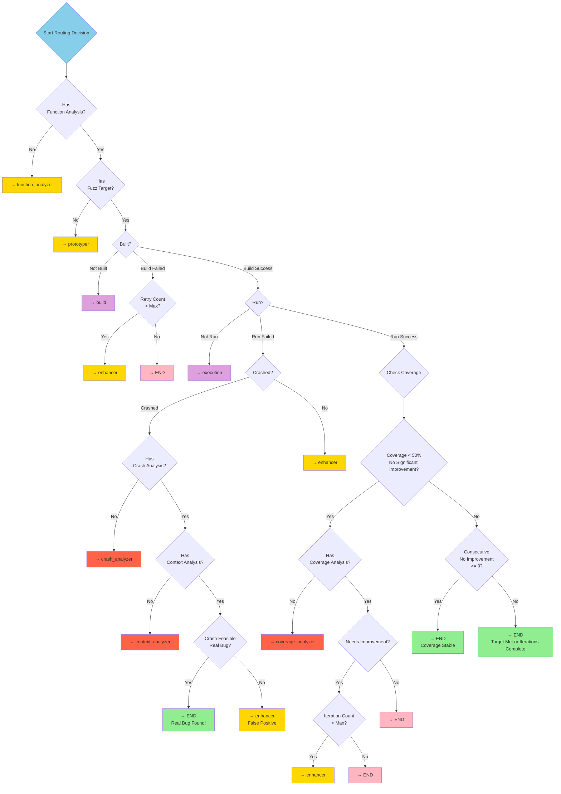
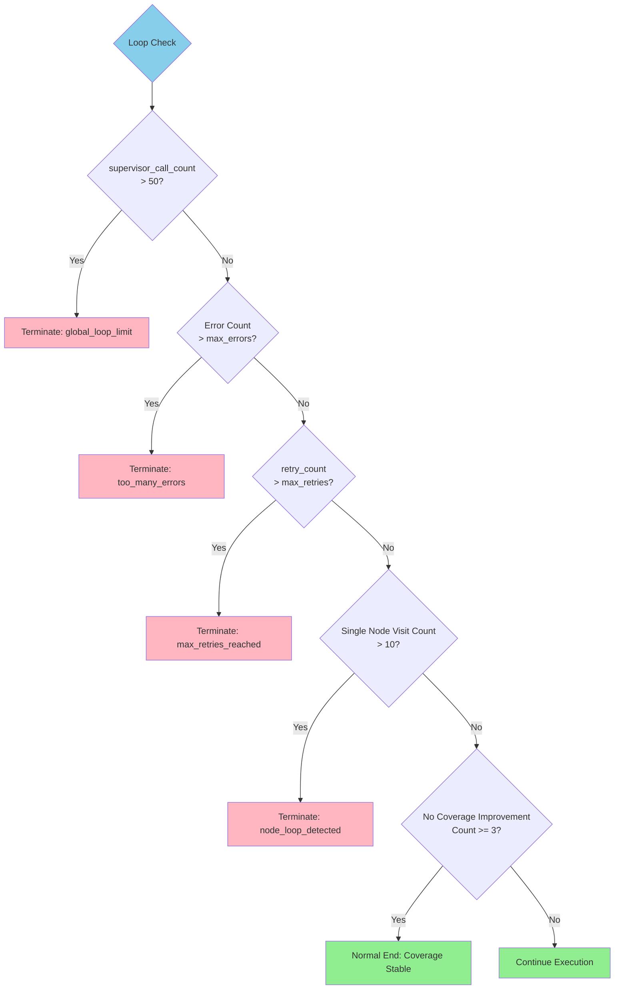
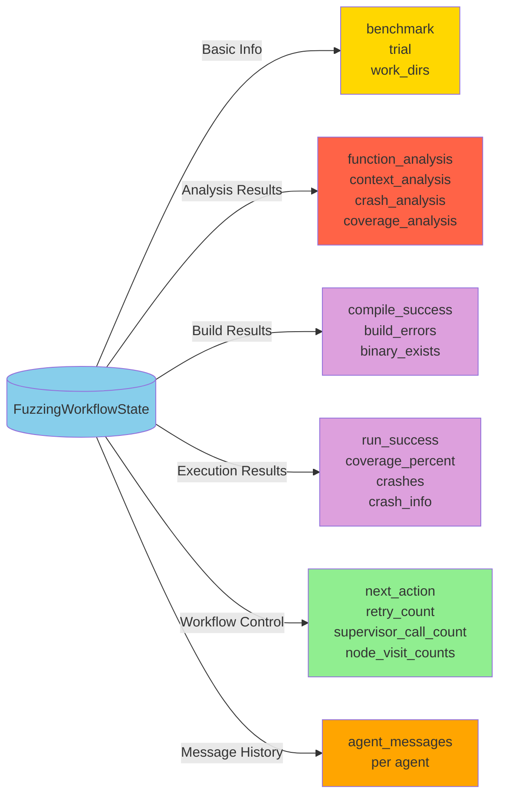

# LangGraph Agent State Machine

## Complete Workflow Diagram


### Core Loop Structure

The workflow follows a **centralized star topology** where all nodes return to Supervisor for next-step decision making:

1. **FunctionAnalyzer** → Supervisor → **Prototyper** → Supervisor → **Build** → Supervisor
2. Build success → **Execution** → Supervisor
3. Build failure → **Enhancer** → Supervisor → Build (retry loop)
4. Crash detected → **CrashAnalyzer** → Supervisor → **ContextAnalyzer** → Supervisor
5. Low coverage → **CoverageAnalyzer** → Supervisor → **Enhancer** → Supervisor (improvement loop)

## State Machine Details

### 1. Node Types

#### Supervisor Node
- **Function**: Decides next action based on current state
- **Input**: Current workflow state
- **Output**: next_action (next node to execute)

#### LLM-Driven Nodes (Using Large Language Models)
- **Function Analyzer**: Analyzes target function, generates function signature and requirements
- **Prototyper**: Generates initial fuzz target and build scripts
- **Enhancer**: Improves fuzz target based on error feedback
- **Crash Analyzer**: Analyzes crash information, determines if it's a real bug
- **Coverage Analyzer**: Analyzes coverage reports, provides improvement suggestions
- **Context Analyzer**: Analyzes crash context, determines feasibility

#### Non-LLM Nodes
- **Build**: Compiles fuzz target
- **Execution**: Runs fuzzer and collects results

### 2. Routing Decision Tree



### 3. Loop Control Mechanism



### 4. State Data Flow



### 5. Typical Execution Paths

#### Path 1: Real Bug Successfully Found
```
Start → Supervisor → FunctionAnalyzer → Supervisor → Prototyper → 
Supervisor → Build → Supervisor → Execution → Supervisor → 
CrashAnalyzer → Supervisor → ContextAnalyzer → Supervisor → END (Real Bug!)
```

#### Path 2: Good Coverage Achieved
```
Start → Supervisor → FunctionAnalyzer → Supervisor → Prototyper → 
Supervisor → Build → Supervisor → Execution → Supervisor → 
CoverageAnalyzer → Supervisor → Enhancer → Supervisor → Build → 
Supervisor → Execution → Supervisor → END (Coverage Target Met)
```

#### Path 3: Build Failure then Fixed
```
Start → Supervisor → FunctionAnalyzer → Supervisor → Prototyper → 
Supervisor → Build (Failed) → Supervisor → Enhancer → Supervisor → 
Build → Supervisor → Execution → Supervisor → END
```

### 6. Key Configuration Parameters

| Parameter | Default | Description |
|------|--------|------|
| MAX_SUPERVISOR_CALLS | 50 | Global supervisor call count limit |
| MAX_NODE_VISITS | 10 | Maximum visits per node |
| max_retries | 3 | Maximum retry count |
| max_errors | 5 | Maximum error count |
| NO_IMPROVEMENT_THRESHOLD | 3 | Threshold for consecutive no-improvement iterations |
| COVERAGE_THRESHOLD | 0.5 | Low coverage threshold (50%) |
| IMPROVEMENT_THRESHOLD | 0.01 | Minimum improvement threshold (1%) |
| SIGNIFICANT_IMPROVEMENT | 0.05 | Significant improvement threshold (5%) |
| max_iterations | 5 | Maximum iteration count |

## Legend

- 🟢 **Green**: Start/Successful End
- 🔵 **Blue**: Supervisor Node
- 🟡 **Yellow**: LLM-Driven Analysis/Generation Nodes
- 🟣 **Purple**: Build/Execution Nodes (Non-LLM)
- 🔴 **Red**: Analysis Nodes (Crash/Coverage)
- 🔴 **Pink**: Abnormal Termination

