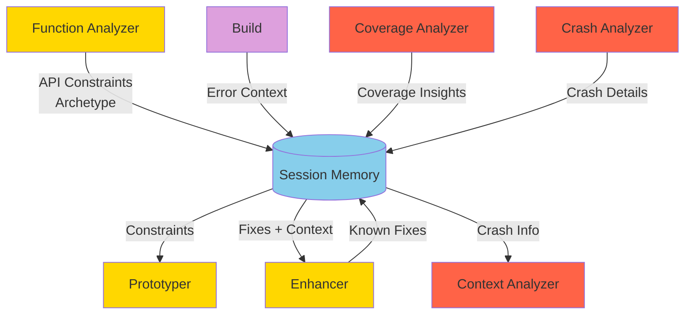
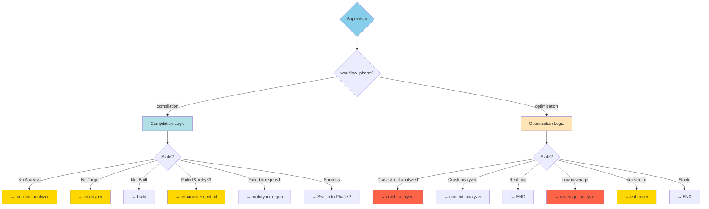
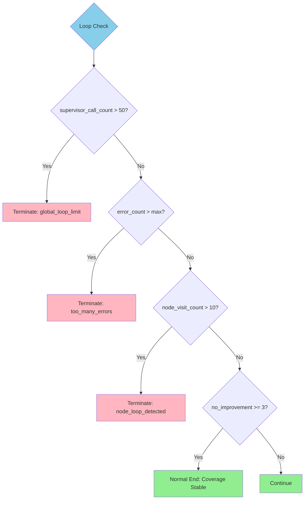

# LangGraph Agent Architecture

Technical documentation for LogicFuzz's multi-agent workflow system.

---

## Architecture Overview

### Two-Phase Workflow Design


**Phase 1 (Compilation)**: Analyze → Generate → Build → Fix (3 retries) → Regenerate (if needed)  
**Phase 2 (Optimization)**: Execute → Analyze (crash/coverage) → Enhance → Repeat

---

## Session Memory Mechanism

Cross-agent knowledge sharing system that prevents repeated mistakes and accelerates convergence.

### Memory Categories

| Memory Type | Stored By | Used By | Purpose |
|-------------|-----------|---------|---------|
| **API Constraints** | Function Analyzer | Prototyper, Enhancer | API usage rules (e.g., "Must call init() before decode()") |
| **Archetype** | Function Analyzer | Prototyper | Architectural pattern (e.g., "stateful_decoder") |
| **Known Fixes** | Enhancer | Enhancer | Previously successful error fixes |
| **Build Context** | Build | Enhancer | Compilation error details and code snippets |
| **Coverage Insights** | Coverage Analyzer | Enhancer | Strategies to improve coverage |
| **Crash Context** | Crash Analyzer | Context Analyzer | Crash details for feasibility validation |

### Memory Flow



**Injection Strategy**: Supervisor injects relevant memory based on current phase, agent type, and iteration count.

---

## Agent Deep Dive

### 1. Supervisor Agent (Central Router)

**Role**: Decision-making hub that orchestrates the workflow

**Key Responsibilities**:
- Route to appropriate agent based on state (phase, counters, results)
- Manage phase transitions (COMPILATION → OPTIMIZATION)
- Enforce loop limits (50 supervisor calls, 10 visits per node)
- Inject Session Memory into prompts

**Routing Logic** (pseudocode):
```python
if workflow_phase == "compilation":
    if not has_function_analysis: return "function_analyzer"
    if not has_fuzz_target: return "prototyper"
    if not built: return "build"
    if build_failed and compilation_retry_count < 3: return "enhancer"
    if build_failed and prototyper_regenerate_count < 1: return "prototyper"
    if build_success: switch_to_optimization()
    
elif workflow_phase == "optimization":
    if has_crash and not analyzed: return "crash_analyzer" → "context_analyzer"
    if crash_feasible: return "END"  # Bug found!
    if coverage_low and not analyzed: return "coverage_analyzer"
    if iteration < max_iterations: return "enhancer"
    else: return "END"
```

---

### 2. Function Analyzer Agent

**Role**: Deep semantic analysis of target function

**Input**:
- Function signature + header files
- Fuzz Introspector context (if available)

**Output** (JSON):
```json
{
  "api_constraints": ["Must call init() before use", "Return NULL on error"],
  "archetype": "stateful_parser",
  "preconditions": ["Input must be null-terminated"],
  "setup_sequence": ["1. Allocate state", "2. Call parse", "3. Free resources"]
}
```

**Analysis Focus**:
- API semantics & calling conventions
- Preconditions & error handling
- Archetype identification (parser, codec, state machine)
- Resource management patterns

---

### 3. Prototyper Agent

**Role**: Generate complete fuzz target + build infrastructure

**Input**: Function analysis + API constraints from Session Memory

**Output**: Fuzz target source code + build.sh

**Generation Strategy**:
```c
// First generation - follows archetype
int LLVMFuzzerTestOneInput(const uint8_t *data, size_t size) {
    if (size < MIN || size > MAX) return 0;  // Preconditions
    
    init_library();                          // Setup sequence
    result_t *r = target_function(data, size);
    if (r) {
        process_result(r);                   // Maximize coverage
        cleanup_result(r);
    }
    cleanup_library();
    return 0;
}
```

**Regeneration** (after 3 failed fixes): Completely new approach using Session Memory errors.

---

### 4. Enhancer Agent

**Role**: Intelligent error fixing and iterative improvement

**Three Modes**:

#### Mode 1: Compilation Error Fixing
- **Input**: Build errors + intelligent code context (error line ±10)
- **Strategy**: Targeted fix (not full regeneration) + store successful patterns
- **Example**: `undefined reference to compress` → Add `-lz` to build script

#### Mode 2: False Positive Crash Fixing
- **Input**: Crash report (marked false positive by Context Analyzer)
- **Strategy**: Add validation, fix memory management, add bounds checking

#### Mode 3: Coverage Improvement
- **Input**: Coverage report + Coverage Analyzer suggestions
- **Strategy**: Add boundary tests, explore code paths, increase API surface
- **Example**:
```c
// Before: Only normal size
if (size > 0) target_function(data, size);

// After: Multiple boundary conditions
target_function(NULL, 0);                    // Empty input
if (size >= 1) target_function(data, 1);     // Minimum
if (size > MIN) target_function(data, size); // Normal
if (size >= MAX) target_function(data, MAX); // Maximum
```

---

### 5. Crash Analyzer Agent

**Role**: Determine crash type and severity

**Input**: Crash reproducer + stack trace + ASAN report

**Output** (JSON):
```json
{
  "crash_type": "heap-buffer-overflow",
  "severity": "high",
  "location": "parse_json:142",
  "preliminary_analysis": "Write beyond allocated buffer",
  "requires_context_analysis": true
}
```

**Classification**: Real bugs (buffer overflow, UAF) vs false positives (OOM, timeout)

---

### 6. Context Analyzer Agent

**Role**: Deep feasibility validation of crashes

**Input**: Crash analysis + source code context + function semantics

**Output** (JSON):
```json
{
  "is_feasible": true,
  "confidence": "high",
  "reasoning": "Buffer overflow in production code path, not harness. Genuine memory safety violation.",
  "recommendation": "REPORT_BUG"
}
```

**Validation Criteria**:
- Crash in target code or fuzzer harness?
- Reachable in real-world usage?
- Security-relevant?
- Realistic input trigger?

---

### 7. Coverage Analyzer Agent

**Role**: Identify uncovered code paths + suggest improvements

**Input**: Coverage report + source code with annotations + fuzz target

**Output** (JSON):
```json
{
  "current_coverage": "45.2%",
  "uncovered_critical_paths": [
    "Error handling in parse_array() (lines 234-245)",
    "Empty input edge case (lines 89-92)"
  ],
  "suggestions": [
    "Add test case: empty array '[]'",
    "Add deeply nested structures to trigger recursion"
  ]
}
```

**Strategy**: Identify high-value uncovered code → Determine why → Suggest specific changes

---

### 8. Build Node (Non-LLM)

**Role**: Compile fuzz target in OSS-Fuzz Docker container

**Process**:
1. Execute build script
2. Capture stdout/stderr
3. Check binary generation
4. Parse compilation errors

**Output**: `compile_success`, `build_errors`, `binary_exists`

---

### 9. Execution Node (Non-LLM)

**Role**: Run fuzzer + collect metrics

**Process**:
1. Execute libFuzzer with binary
2. Monitor crashes/timeouts
3. Collect LLVM source-based coverage
4. Save crash reproducers

**Config**: 60s timeout, ASAN enabled, line/branch coverage

**Output**: `run_success`, `coverage_percent`, `crashes`, `crash_info`

---

## Supervisor Routing Logic

### Phase-Aware Routing



**Key Differences**:
- **COMPILATION**: `compilation_retry_count` (max 3), intelligent code context, Prototyper regeneration
- **OPTIMIZATION**: `retry_count`, coverage thresholds (50%, 5% diff), crash feasibility validation

---

## Loop Control & Termination



**Configuration**:

| Parameter | Default | Description |
|-----------|---------|-------------|
| MAX_SUPERVISOR_CALLS | 50 | Global call limit |
| MAX_NODE_VISITS | 10 | Per-node visit limit |
| NO_IMPROVEMENT_THRESHOLD | 3 | Stagnation detection |
| COVERAGE_THRESHOLD | 0.5 | Low coverage (50%) |
| SIGNIFICANT_IMPROVEMENT | 0.05 | Improvement threshold (5%) |
| max_iterations | 5 | Optimization iterations |

---

## Implementation Patterns

### 1. LangGraph State Machine

```python
# workflow.py
from langgraph.graph import StateGraph, END

workflow = StateGraph(FuzzingWorkflowState)

# Add nodes
workflow.add_node("supervisor", supervisor_node)
workflow.add_node("function_analyzer", function_analyzer_node)
# ... more nodes

# Conditional edges from supervisor
workflow.add_conditional_edges(
    "supervisor",
    lambda state: state["next_action"],
    {
        "function_analyzer": "function_analyzer",
        "prototyper": "prototyper",
        "build": "build",
        "END": END
    }
)

# All nodes return to supervisor
workflow.add_edge("function_analyzer", "supervisor")
workflow.add_edge("prototyper", "supervisor")
```

### 2. Structured LLM Agent

```python
# agents/langgraph_agent.py
class LLMAgent:
    def __init__(self, model_name: str, system_prompt: str):
        self.model = get_llm_model(model_name)
        self.system_prompt = system_prompt
    
    def invoke(self, user_prompt: str, output_schema: dict = None):
        """Invoke LLM with structured output"""
        if output_schema:
            response = self.model.with_structured_output(output_schema).invoke(messages)
        else:
            response = self.model.invoke(messages)
        return response
```

### 3. Intelligent Code Context Extraction

```python
# agents/utils.py
def extract_error_context(source_code: str, error_line: int, context_lines: int = 10) -> str:
    """Extract ±N lines around error for focused fixing"""
    lines = source_code.split('\n')
    start = max(0, error_line - context_lines)
    end = min(len(lines), error_line + context_lines + 1)
    
    context = []
    for i in range(start, end):
        marker = " >>> " if i == error_line else "     "
        context.append(f"{marker}{i+1:4d} | {lines[i]}")
    
    return "\n".join(context)
```

### 4. Session Memory Injection

```python
# session_memory_injector.py
def inject_session_memory(prompt: str, state: FuzzingWorkflowState, agent_type: str) -> str:
    memory = state.get("session_memory", {})
    
    if agent_type == "enhancer":
        known_fixes = memory.get("known_fixes", [])
        api_constraints = memory.get("api_constraints", [])
        
        memory_section = "\n\n## Session Memory\n"
        if known_fixes:
            memory_section += "### Known Fixes:\n" + "\n".join(f"- {fix}" for fix in known_fixes)
        if api_constraints:
            memory_section += "\n### API Constraints:\n" + "\n".join(f"- {c}" for c in api_constraints)
        
        return prompt + memory_section
    
    return prompt
```

---

## File Structure

```
agent_graph/
├── workflow.py              # LangGraph workflow definition
├── state.py                 # FuzzingWorkflowState schema
├── main.py                  # Entry point with CLI
│
├── nodes/                   # Agent implementations
│   ├── supervisor_node.py   # Central routing logic
│   ├── function_analyzer_node.py
│   ├── prototyper_node.py
│   ├── enhancer_node.py
│   ├── crash_analyzer_node.py
│   ├── context_analyzer_node.py
│   ├── coverage_analyzer_node.py
│   └── execution_node.py
│
├── agents/                  # Base classes & utilities
│   ├── langgraph_agent.py   # LLMAgent base class
│   └── utils.py             # Helper functions
│
├── prompt_loader.py         # Loads prompts from prompts/
├── memory.py                # SessionMemory class
└── session_memory_injector.py
```

---

## Prompt Engineering Strategy

All system prompts stored in `prompts/` directory:

- `function_analyzer.txt` - Semantic analysis instructions
- `prototyper.txt` - Code generation guidelines + examples
- `enhancer.txt` - Error fixing & optimization strategies
- `crash_analyzer.txt` - Crash classification instructions
- `context_analyzer.txt` - Feasibility validation criteria
- `coverage_analyzer.txt` - Coverage improvement strategies

**Techniques**:
- Few-shot examples for code generation
- Structured output schemas (JSON)
- Chain-of-thought reasoning
- Phase-specific instructions
- Token optimization (80% reduction)

---

## Legend

- 🟢 **Green**: Start/Success
- 🔵 **Blue**: Supervisor
- 🟡 **Yellow**: LLM-Driven Agents
- 🟣 **Purple**: Build/Execution
- 🔴 **Red**: Analyzers
- 🔴 **Pink**: Termination

---

## Further Reading

- [Main README](../README.md) - Project overview
- [NEW_PROJECT_SETUP.md](../docs/NEW_PROJECT_SETUP.md) - Setup guide
- [FUNCTION_ANALYZER_REDESIGN.md](../FUNCTION_ANALYZER_REDESIGN.md) - Function Analyzer evolution
