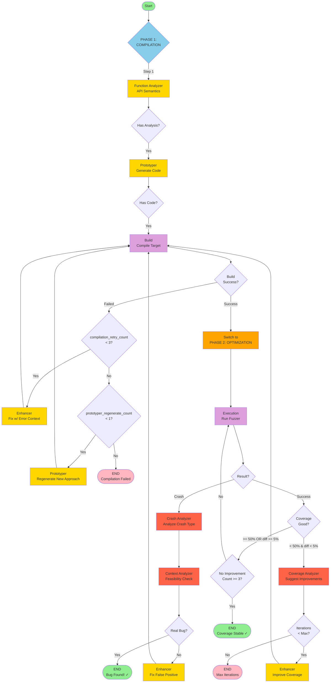
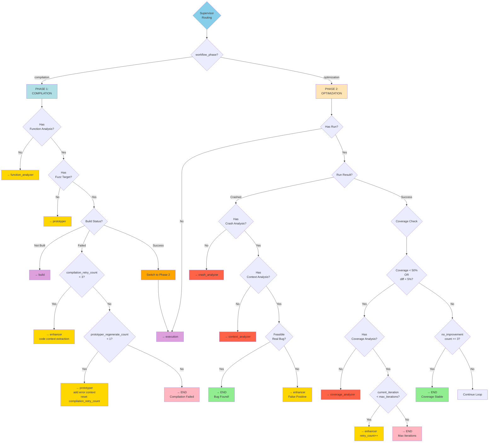
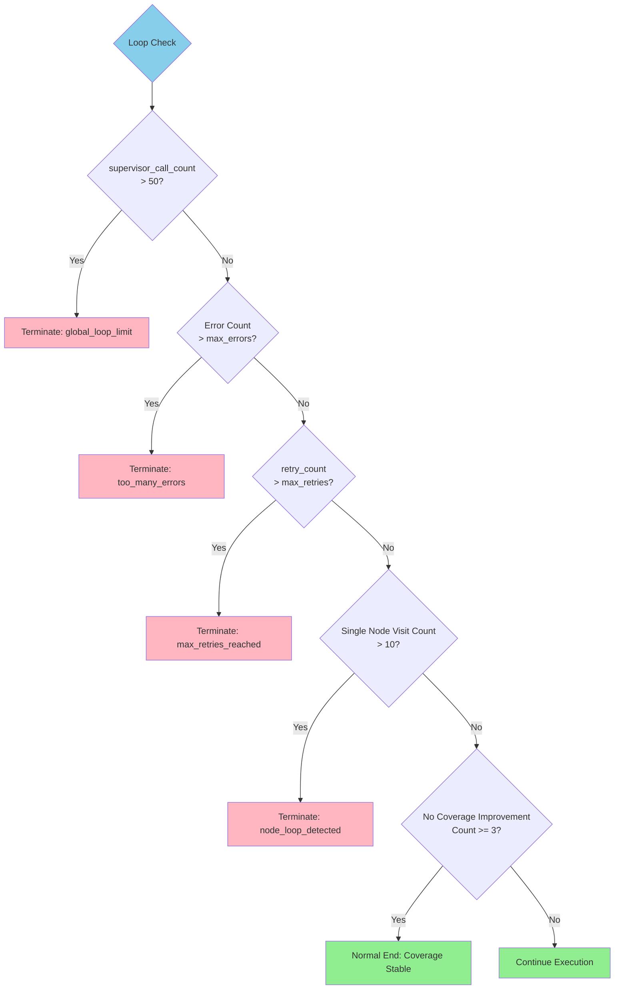
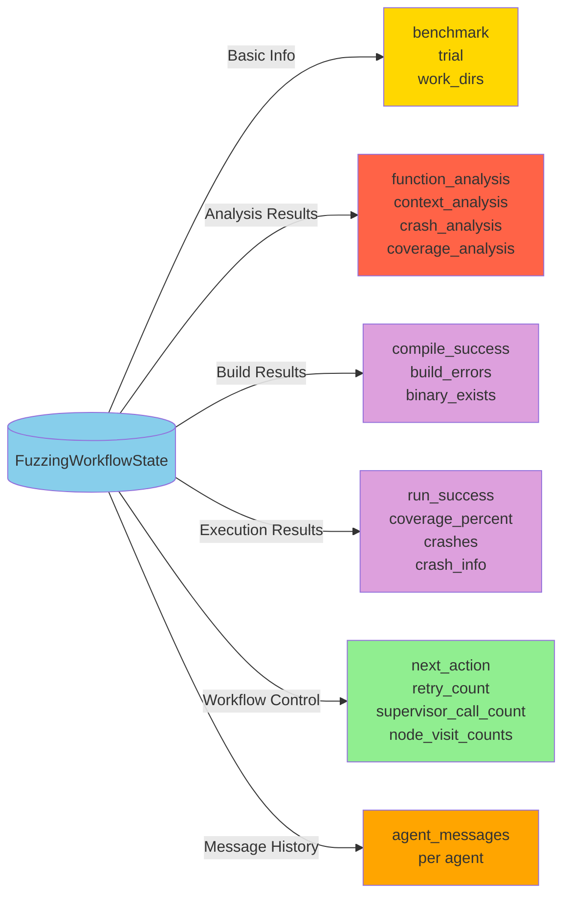

# LangGraph Agent State Machine

## Two-Phase Workflow Architecture

LogicFuzz implements a **two-phase workflow** to separate compilation concerns from optimization goals:

### **Phase 1: COMPILATION** 
Focus: Get the fuzz target to compile successfully
- Function Analysis → Code Generation → Compilation Fixing
- Dedicated retry counters and strategies
- Prototyper regeneration with error context

### **Phase 2: OPTIMIZATION**
Focus: Maximize coverage and discover bugs
- Execution → Analysis → Iterative Improvement
- Coverage-driven enhancement
- Crash analysis and feasibility checking

---

## Complete Workflow Diagram



### Core Workflow Principles

The workflow follows a **two-phase centralized routing** where:

**Phase 1 (Compilation):**
1. **FunctionAnalyzer** analyzes API semantics (preconditions, setup sequence, constraints)
2. **Prototyper** generates initial fuzz target
3. **Build** attempts compilation
4. **Enhancer** fixes errors (max 3 retries with intelligent code context)
5. **Prototyper Regeneration** if enhancer fails (completely new approach)

**Phase 2 (Optimization):**
1. **Execution** runs the fuzz target and collects metrics
2. **CrashAnalyzer** + **ContextAnalyzer** validate crashes (feasibility checking)
3. **CoverageAnalyzer** suggests improvements for low coverage
4. **Enhancer** iteratively improves the target
5. Loops until good coverage, bug found, or max iterations

## State Machine Details

### 1. Node Types

#### Supervisor Node
- **Function**: Decides next action based on current state
- **Input**: Current workflow state
- **Output**: next_action (next node to execute)

#### LLM-Driven Nodes (Using Large Language Models)
- **Function Analyzer**: Analyzes target function, generates function signature and requirements
- **Prototyper**: Generates initial fuzz target and build scripts
- **Enhancer**: Improves fuzz target based on error feedback
- **Crash Analyzer**: Analyzes crash information, determines if it's a real bug
- **Coverage Analyzer**: Analyzes coverage reports, provides improvement suggestions
- **Context Analyzer**: Analyzes crash context, determines feasibility

#### Non-LLM Nodes
- **Build**: Compiles fuzz target
- **Execution**: Runs fuzzer and collects results

### 2. Two-Phase Routing Logic

The Supervisor implements **phase-aware routing** with different strategies for compilation vs optimization:



#### Key Routing Differences Between Phases:

**COMPILATION Phase:**
- Uses `compilation_retry_count` (max 3)
- Enables Prototyper regeneration after retry exhaustion
- Enhancer receives intelligent code context (error lines ±10)
- Automatically switches to OPTIMIZATION on build success

**OPTIMIZATION Phase:**
- Uses `retry_count` for enhancement iterations
- Tracks `no_coverage_improvement_count` for stagnation detection
- Coverage-driven decision making (50% threshold, 5% diff)
- Crash feasibility validation before termination

### 3. Loop Control Mechanism



### 4. State Data Flow



### 5. Typical Execution Paths

#### Path 1: Real Bug Successfully Found
```
Start → Supervisor → FunctionAnalyzer → Supervisor → Prototyper → 
Supervisor → Build → Supervisor → Execution → Supervisor → 
CrashAnalyzer → Supervisor → ContextAnalyzer → Supervisor → END (Real Bug!)
```

#### Path 2: Good Coverage Achieved
```
Start → Supervisor → FunctionAnalyzer → Supervisor → Prototyper → 
Supervisor → Build → Supervisor → Execution → Supervisor → 
CoverageAnalyzer → Supervisor → Enhancer → Supervisor → Build → 
Supervisor → Execution → Supervisor → END (Coverage Target Met)
```

#### Path 3: Build Failure then Fixed
```
Start → Supervisor → FunctionAnalyzer → Supervisor → Prototyper → 
Supervisor → Build (Failed) → Supervisor → Enhancer → Supervisor → 
Build → Supervisor → Execution → Supervisor → END
```

### 6. Key Configuration Parameters

| Parameter | Default | Description |
|------|--------|------|
| MAX_SUPERVISOR_CALLS | 50 | Global supervisor call count limit |
| MAX_NODE_VISITS | 10 | Maximum visits per node |
| max_retries | 3 | Maximum retry count |
| max_errors | 5 | Maximum error count |
| NO_IMPROVEMENT_THRESHOLD | 3 | Threshold for consecutive no-improvement iterations |
| COVERAGE_THRESHOLD | 0.5 | Low coverage threshold (50%) |
| IMPROVEMENT_THRESHOLD | 0.01 | Minimum improvement threshold (1%) |
| SIGNIFICANT_IMPROVEMENT | 0.05 | Significant improvement threshold (5%) |
| max_iterations | 5 | Maximum iteration count |

## Legend

- 🟢 **Green**: Start/Successful End
- 🔵 **Blue**: Supervisor Node
- 🟡 **Yellow**: LLM-Driven Analysis/Generation Nodes
- 🟣 **Purple**: Build/Execution Nodes (Non-LLM)
- 🔴 **Red**: Analysis Nodes (Crash/Coverage)
- 🔴 **Pink**: Abnormal Termination

