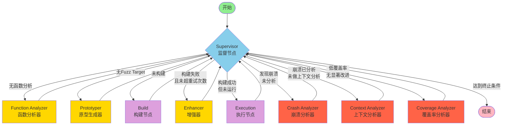
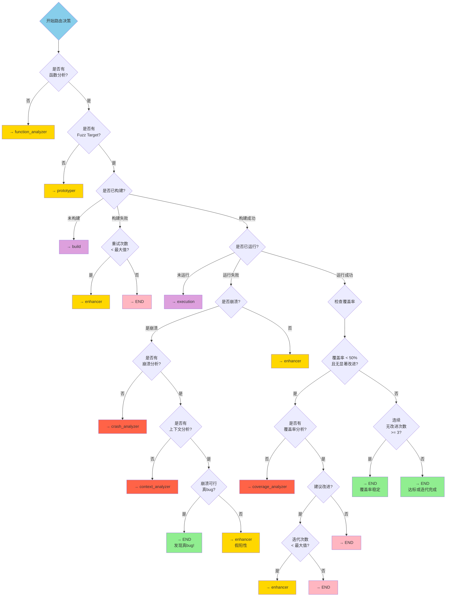
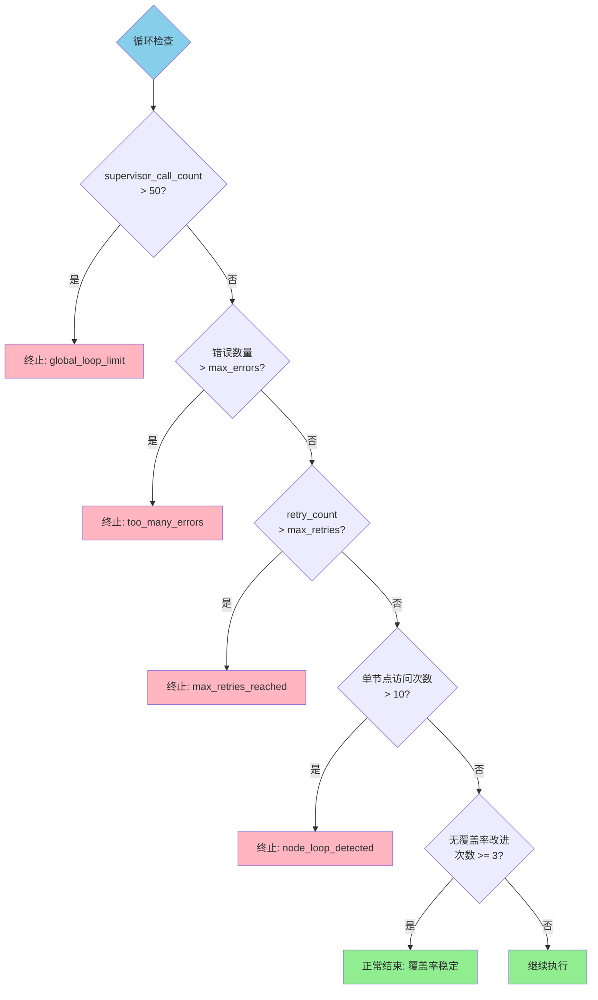
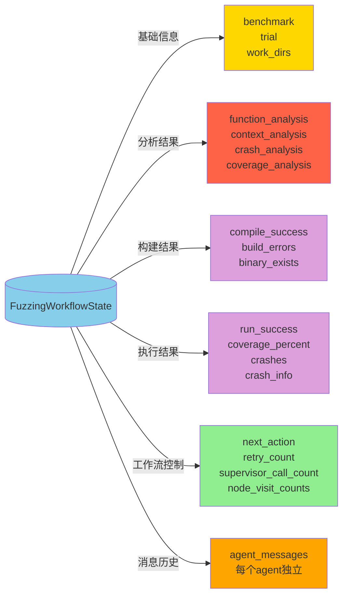

# LangGraph Agent 状态机图

## 完整工作流程图



## 状态机详细说明

### 1. 节点类型

#### 监督节点 (Supervisor)
- **功能**: 根据当前状态决定下一步操作
- **输入**: 当前工作流状态
- **输出**: next_action (下一个要执行的节点)

#### LLM驱动节点 (使用大语言模型)
- **Function Analyzer**: 分析目标函数，生成函数签名和需求
- **Prototyper**: 生成初始的fuzz target和构建脚本
- **Enhancer**: 基于错误反馈改进fuzz target
- **Crash Analyzer**: 分析崩溃信息，判断是否为真bug
- **Coverage Analyzer**: 分析覆盖率报告，提供改进建议
- **Context Analyzer**: 分析崩溃的上下文，判断可行性

#### 非LLM节点
- **Build**: 编译fuzz target
- **Execution**: 运行fuzzer并收集结果

### 2. 路由决策树



### 3. 循环控制机制



### 4. 状态数据流



### 5. 典型执行路径

#### 路径1: 成功发现真bug
```
Start → Supervisor → FunctionAnalyzer → Supervisor → Prototyper → 
Supervisor → Build → Supervisor → Execution → Supervisor → 
CrashAnalyzer → Supervisor → ContextAnalyzer → Supervisor → END (真bug!)
```

#### 路径2: 达到良好覆盖率
```
Start → Supervisor → FunctionAnalyzer → Supervisor → Prototyper → 
Supervisor → Build → Supervisor → Execution → Supervisor → 
CoverageAnalyzer → Supervisor → Enhancer → Supervisor → Build → 
Supervisor → Execution → Supervisor → END (覆盖率达标)
```

#### 路径3: 构建失败后修复
```
Start → Supervisor → FunctionAnalyzer → Supervisor → Prototyper → 
Supervisor → Build (失败) → Supervisor → Enhancer → Supervisor → 
Build → Supervisor → Execution → Supervisor → END
```

### 6. 关键配置参数

| 参数 | 默认值 | 说明 |
|------|--------|------|
| MAX_SUPERVISOR_CALLS | 50 | 全局supervisor调用次数上限 |
| MAX_NODE_VISITS | 10 | 单个节点最大访问次数 |
| max_retries | 3 | 最大重试次数 |
| max_errors | 5 | 最大错误数量 |
| NO_IMPROVEMENT_THRESHOLD | 3 | 连续无覆盖率改进次数阈值 |
| COVERAGE_THRESHOLD | 0.5 | 低覆盖率阈值 (50%) |
| IMPROVEMENT_THRESHOLD | 0.01 | 最小改进阈值 (1%) |
| SIGNIFICANT_IMPROVEMENT | 0.05 | 显著改进阈值 (5%) |
| max_iterations | 5 | 最大迭代次数 |

## 图例说明

- 🟢 **绿色**: 开始/成功结束
- 🔵 **蓝色**: Supervisor监督节点
- 🟡 **黄色**: LLM驱动的分析/生成节点
- 🟣 **紫色**: 构建/执行节点（非LLM）
- 🔴 **红色**: 分析节点（崩溃/覆盖率）
- 🔴 **粉色**: 异常终止

