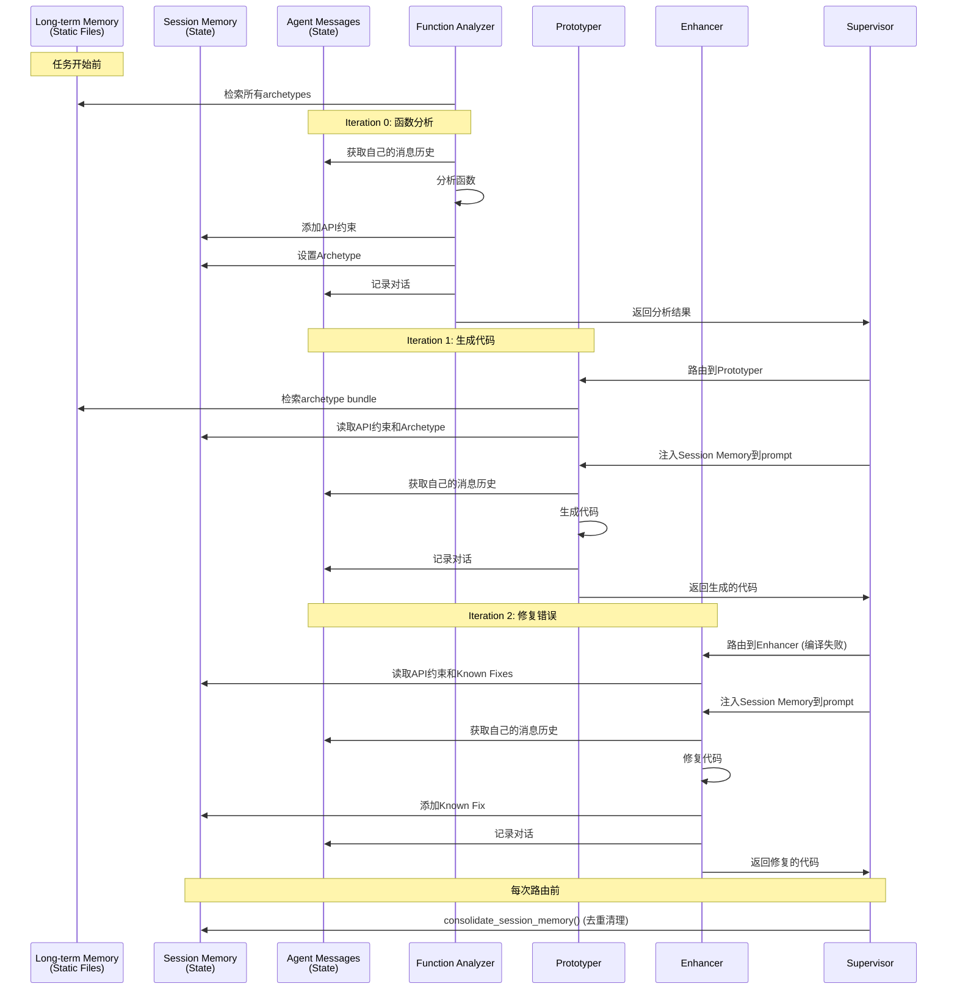

# Memory Architecture Design

LogicFuzz 的记忆系统设计文档

---

## 目录

1. [概述](#概述)
2. [Long-term Memory (长期记忆)](#long-term-memory-长期记忆)
3. [Short-term Memory (短期记忆) - Session Memory](#short-term-memory-短期记忆---session-memory)
4. [Agent Message History (对话历史)](#agent-message-history-对话历史)
5. [Memory 交互流程](#memory-交互流程)
6. [实现细节](#实现细节)
7. [未来扩展](#未来扩展)

---

## 概述

LogicFuzz 采用**三层记忆架构**，模拟人类的认知系统：

| Memory Type | 生命周期 | 作用范围 | 主要用途 |
|-------------|---------|---------|---------|
| **Long-term Memory** | 永久 (静态文件) | 全局 (所有任务) | 静态知识库：API模式、代码模板、常见陷阱 |
| **Session Memory** | 单次运行 | 任务级 (跨所有Agent) | 动态共识约束：API约束、已知修复、决策记录 |
| **Agent Messages** | 单次运行 | Agent级 (单个Agent) | 对话历史：LLM交互记录、上下文管理 |

### 设计理念

```
┌─────────────────────────────────────────────────────────────┐
│                    Long-term Memory                         │
│  (Static Knowledge Base - 静态知识库)                        │
│  • Archetypes (API 行为模式)                                 │
│  • Skeletons (代码模板)                                      │
│  • Pitfalls (常见错误模式)                                   │
└─────────────────────┬───────────────────────────────────────┘
                      │ 检索 (每次新任务)
                      ↓
┌─────────────────────────────────────────────────────────────┐
│              Session Memory (会话记忆)                        │
│  (Task-level Consensus - 任务级共识)                         │
│  • API Constraints (API约束)                                │
│  • Archetype (识别的架构模式)                                │
│  • Known Fixes (已知错误修复)                                │
│  • Decisions (关键决策记录)                                  │
│  • Coverage Strategies (覆盖率优化策略)                      │
└──────┬──────────────────────────────────┬──────────────────┘
       │ 注入到提示                        │ 跨Agent共享
       ↓                                  ↓
┌──────────────────┐  ┌──────────────────┐  ┌──────────────┐
│  Function        │  │   Prototyper     │  │   Enhancer   │
│  Analyzer        │  │                  │  │              │
│  Messages        │  │   Messages       │  │   Messages   │
│  (对话历史)       │  │   (对话历史)      │  │   (对话历史)  │
└──────────────────┘  └──────────────────┘  └──────────────┘
```

---

## Long-term Memory (长期记忆)

### 定位
静态知识库，存储**跨项目通用**的模式化知识，不随任务运行而改变。

### 目录结构

```
long_term_memory/
├── archetypes/              # 6种API行为模式
│   ├── stateless_parser.md
│   ├── object_lifecycle.md
│   ├── state_machine.md
│   ├── stream_processor.md
│   ├── round_trip.md
│   └── file_based.md
│
├── skeletons/               # 代码模板 (每个archetype对应一个)
│   ├── stateless_parser_skeleton.c
│   ├── object_lifecycle_skeleton.c
│   ├── state_machine_skeleton.c
│   ├── stream_processor_skeleton.c
│   ├── round_trip_skeleton.c
│   └── file_based_skeleton.c
│
├── pitfalls/                # 常见错误模式 (4类)
│   ├── initialization_errors.md
│   ├── data_argument_errors.md
│   ├── call_sequence_errors.md
│   └── resource_management.md
│
└── retrieval.py             # KnowledgeRetriever 实现
```

### Archetypes (API行为模式)

6种经验总结的API使用模式：

| Archetype | 特征 | 典型例子 |
|-----------|------|---------|
| **Stateless Parser** | 单函数，无状态，纯解析 | `json_parse(data, size)` |
| **Object Lifecycle** | 创建 → 使用 → 销毁 | `ctx = create(); use(ctx); destroy(ctx)` |
| **State Machine** | 多状态转换，顺序敏感 | `init() → open() → process() → close()` |
| **Stream Processor** | 流式处理，增量输入 | `write(chunk1); write(chunk2); finalize()` |
| **Round Trip** | 编码-解码往返 | `encoded = encode(data); decode(encoded)` |
| **File-based** | 基于文件I/O的API | `load_file(path); process(); save_file()` |

每个archetype文档包含：
- **Pattern Signature**: 可视化表示
- **Characteristics**: 何时使用此模式
- **Preconditions**: 调用前需满足的条件
- **Postconditions**: 调用后保证的状态
- **Driver Pattern**: 完整代码示例
- **Parameter Strategy**: 每个参数如何构造
- **Common Pitfalls**: 需要避免的陷阱
- **Real Examples**: 实际API案例

### Skeletons (代码模板)

每个archetype对应的C/C++代码骨架，提供给Prototyper参考生成。

**示例** (Stateless Parser Skeleton):
```c
#include <stdint.h>
#include <stddef.h>

int LLVMFuzzerTestOneInput(const uint8_t *data, size_t size) {
    // 1. 边界检查
    if (size < MIN_SIZE || size > MAX_SIZE) return 0;
    
    // 2. 数据预处理 (如需null-terminated)
    uint8_t *null_terminated = malloc(size + 1);
    memcpy(null_terminated, data, size);
    null_terminated[size] = '\0';
    
    // 3. 调用目标函数
    result_t *result = target_function(null_terminated, size);
    
    // 4. 清理资源
    if (result) free_result(result);
    free(null_terminated);
    
    return 0;
}
```

### Pitfalls (常见错误模式)

4类跨archetype的通用错误模式：

| Pitfall Category | 描述 | 典型错误 |
|------------------|------|---------|
| **Initialization Errors** | 初始化相关 | 未调用init、重复初始化 |
| **Data Argument Errors** | 数据参数问题 | NULL指针、缓冲区不足、未null-terminated |
| **Call Sequence Errors** | 调用顺序错误 | 未open就read、重复close |
| **Resource Management** | 资源管理 | 内存泄漏、double-free、未close |

每个pitfall文档包含：
- 错误模式描述
- 真实案例
- 检测方法
- 修复策略

### Archetype-Pitfall 映射

```python
ARCHETYPE_PITFALLS = {
    "stateless_parser": ["data_argument_errors"],
    "object_lifecycle": ["initialization_errors", "data_argument_errors", 
                        "call_sequence_errors", "resource_management"],
    "state_machine": ["initialization_errors", "call_sequence_errors", 
                     "resource_management"],
    "stream_processor": ["call_sequence_errors", "resource_management"],
    "round_trip": ["data_argument_errors", "resource_management"],
    "file_based": ["resource_management"]
}
```

### KnowledgeRetriever API

```python
from long_term_memory.retrieval import KnowledgeRetriever

retriever = KnowledgeRetriever()

# 获取单个组件
archetype_doc = retriever.get_archetype("object_lifecycle")
skeleton_code = retriever.get_skeleton("object_lifecycle")
pitfall_guide = retriever.get_pitfall("initialization_errors")

# 获取完整bundle (archetype + skeleton + relevant pitfalls)
bundle = retriever.get_bundle("object_lifecycle")
# => {
#     'archetype': "...",
#     'skeleton': "...",
#     'pitfalls': {
#         'initialization_errors': "...",
#         'data_argument_errors': "...",
#         ...
#     }
# }

# 获取archetype相关的pitfalls
relevant_pitfalls = retriever.get_relevant_pitfalls("state_machine")
```

### 使用时机

| Agent | 何时检索 | 检索内容 |
|-------|---------|---------|
| **Function Analyzer** | 分析函数时 | 所有archetypes (用于模式匹配) |
| **Prototyper** | 生成代码时 | 识别的archetype的bundle (doc + skeleton + pitfalls) |
| **Enhancer** | 修复错误时 | 相关pitfalls (基于错误类型) |

---

## Short-term Memory (短期记忆) - Session Memory

### 定位
**任务级共识约束存储**，在单次fuzzing任务运行期间，跨所有Agent共享的动态知识。

### 数据结构

```python
session_memory = {
    "api_constraints": [
        {
            "constraint": "Must call json_init() before json_parse()",
            "source": "function_analyzer",
            "confidence": "high",  # high/medium/low
            "iteration": 0
        },
        ...
    ],
    
    "archetype": {
        "type": "stateful_decoder",
        "lifecycle_phases": ["init", "decode", "cleanup"],
        "source": "function_analyzer",
        "iteration": 0
    },
    
    "known_fixes": [
        {
            "error_pattern": "undefined reference to 'json_init'",
            "solution": "Add #include <json/json.h> and link -ljson",
            "source": "enhancer",
            "iteration": 2
        },
        ...
    ],
    
    "decisions": [
        {
            "decision": "Use stateful_decoder skeleton",
            "reason": "API requires init before use",
            "source": "prototyper",
            "iteration": 1
        },
        ...
    ],
    
    "coverage_strategies": [
        {
            "strategy": "Add boundary test for size=0 and size=MAX",
            "target": "Reach error handling branches",
            "source": "coverage_analyzer",
            "iteration": 3
        },
        ...
    ]
}
```

### 五大类别

#### 1. API Constraints (API约束)
**存储者**: Function Analyzer, Context Analyzer
**使用者**: Prototyper, Enhancer

**示例**:
- "Must call init() before decode()"
- "Return value must be freed by caller"
- "Input must be null-terminated"
- "Cannot call decode() after cleanup()"

**Confidence Level**:
- `high`: 从文档/代码明确确认
- `medium`: 从代码逻辑推断
- `low`: 根据经验猜测

#### 2. Archetype (架构模式)
**存储者**: Function Analyzer
**使用者**: Prototyper

识别的API行为模式，只存储一个（最符合的）。

**示例**:
```python
{
    "type": "object_lifecycle",
    "lifecycle_phases": ["create", "use", "destroy"],
    "source": "function_analyzer",
    "iteration": 0
}
```

#### 3. Known Fixes (已知错误修复)
**存储者**: Enhancer
**使用者**: Enhancer (在后续迭代中避免重复错误)

**示例**:
- Error: "undefined reference to compress" → Solution: "Add -lz to linker flags"
- Error: "segfault on NULL input" → Solution: "Add NULL check at line 15"

**去重逻辑**: 基于 `error_pattern`，相同错误只保留最新解决方案。

**长度限制**: 最多保留最近10条。

#### 4. Decisions (关键决策记录)
**存储者**: 所有Agent
**使用者**: Supervisor (路由决策时参考)

记录关键决策点及其理由，帮助Supervisor避免陷入循环。

**示例**:
- Decision: "Regenerate from scratch" | Reason: "3 attempts to fix compilation all failed"
- Decision: "Skip coverage improvement" | Reason: "Already reached 80% coverage"

**长度限制**: 最多保留最近10条。

#### 5. Coverage Strategies (覆盖率优化策略)
**存储者**: Coverage Analyzer
**使用者**: Enhancer

**示例**:
- Strategy: "Add NULL input test" | Target: "Cover error path at line 45"
- Strategy: "Increase max input size to 10KB" | Target: "Trigger buffer reallocation"

**去重逻辑**: 基于 `strategy` 内容去重。

**长度限制**: 最多保留最近10条。

### Session Memory 管理函数

```python
# agent_graph/state.py

# 添加API约束
add_api_constraint(
    state,
    constraint="Must initialize before use",
    source="function_analyzer",
    confidence="high",
    iteration=0
)

# 设置Archetype
set_archetype(
    state,
    archetype_type="stateful_decoder",
    lifecycle_phases=["init", "decode", "cleanup"],
    source="function_analyzer",
    iteration=0
)

# 添加已知修复
add_known_fix(
    state,
    error_pattern="undefined reference to compress",
    solution="Add -lz to build script",
    source="enhancer",
    iteration=2
)

# 添加决策记录
add_decision(
    state,
    decision="Regenerate from scratch",
    reason="3 compilation fixes failed",
    source="supervisor",
    iteration=3
)

# 添加覆盖率策略
add_coverage_strategy(
    state,
    strategy="Add boundary tests for size=0 and size=MAX",
    target="Cover error handling branches",
    source="coverage_analyzer",
    iteration=4
)

# 格式化为文本 (注入到prompt)
formatted_text = format_session_memory_for_prompt(state)

# 整理去重 (Supervisor定期调用)
cleaned_memory = consolidate_session_memory(state)
```

### Session Memory 注入机制

通过 `session_memory_injector.py` 将共识约束注入到Agent的提示中。

```python
from agent_graph.session_memory_injector import build_prompt_with_session_memory

# 构建完整prompt (包含session memory)
full_prompt = build_prompt_with_session_memory(
    state,
    agent_specific_prompt="Please fix the following compilation error...",
    agent_name="enhancer"
)
```

**注入策略**:
- **Prototyper**: 注入 `api_constraints` + `archetype`
- **Enhancer**: 注入 `api_constraints` + `known_fixes` + `coverage_strategies`
- **Context Analyzer**: 注入 `api_constraints` + `crash_context`
- **Crash Analyzer**: 注入 `crash_details`

**格式化输出示例**:
```
## Session Memory (Consensus Constraints)

### API Usage Constraints
- [HIGH] Must call json_init() before json_parse()
  *source: function_analyzer, iteration: 0*
- [MEDIUM] Return value should be freed by caller
  *source: function_analyzer, iteration: 0*

### Identified Architecture Pattern
- **Type**: stateful_decoder
- **Lifecycle**: init → decode → cleanup
- *source: function_analyzer, iteration: 0*

### Known Error Fixes
- **Error**: undefined reference to 'compress'
  **Solution**: Add -lz to linker flags in build.sh
  *source: enhancer, iteration: 2*

### Coverage Optimization Strategies
- Add boundary test for size=0 and size=MAX
  *target: Cover error handling branches, source: coverage_analyzer*
```

### 去重与清理

Supervisor在每次路由前调用 `consolidate_session_memory()` 进行清理：

**去重规则**:
1. **API Constraints**: 基于 `constraint` 内容，保留confidence最高的
2. **Known Fixes**: 基于 `error_pattern`，保留最新的
3. **Decisions**: 保留最近10条
4. **Coverage Strategies**: 基于 `strategy` 内容去重，保留最近10条

**为什么需要去重**:
- 避免相同约束重复注入，浪费tokens
- 保持session memory简洁，提高LLM关注度
- 防止内存无限增长

---

## Agent Message History (对话历史)

### 定位
**Agent级对话历史**，每个Agent独立维护自己的LLM交互记录。

### 数据结构

```python
agent_messages = {
    "function_analyzer": [
        {"role": "system", "content": "You are a function analyzer..."},
        {"role": "user", "content": "Analyze this function: ..."},
        {"role": "assistant", "content": "Analysis result: ..."}
    ],
    "prototyper": [
        {"role": "system", "content": "You are a code generator..."},
        {"role": "user", "content": "Generate fuzz target for: ..."},
        {"role": "assistant", "content": "Here is the code: ..."}
    ],
    ...
}
```

### 特点

| 特性 | 说明 |
|------|------|
| **隔离性** | 每个Agent独立维护，互不干扰 |
| **持久性** | 在单次任务运行期间持续存在 |
| **自动截断** | Token-aware trimming，避免上下文溢出 |
| **系统消息** | 每个Agent首次初始化时添加system message |

### Token-Aware Trimming

```python
# agent_graph/memory.py

def trim_messages_by_tokens(
    messages: List[Dict[str, Any]], 
    max_tokens: int = 100000,  # 每个Agent最多100k tokens
    keep_system: bool = True,
    system_max_tokens: int = 10000  # System message最多10k
) -> List[Dict[str, Any]]:
    """
    截断策略:
    1. 始终保留system message (如果keep_system=True)
    2. 如果system message超过10k，截断到10k
    3. 保留最近的user/assistant消息，直到达到100k token限制
    4. 从最旧的消息开始删除
    """
```

**为什么需要Trimming**:
- LLM有最大上下文长度限制 (如GPT-4 128k tokens)
- 避免早期迭代的噪音影响后期决策
- 保留最近的、最相关的上下文

### Message管理函数

```python
from agent_graph.memory import get_agent_messages, add_agent_message

# 获取Agent的消息历史
messages = get_agent_messages(state, "enhancer", system_message="You are an enhancer...")

# 添加新消息
add_agent_message(state, "enhancer", role="user", content="Fix this error: ...")
add_agent_message(state, "enhancer", role="assistant", content="Fixed: ...")
```

### Reducer机制 (LangGraph)

```python
# agent_graph/state.py

def add_agent_messages(
    left: Dict[str, List[Dict[str, Any]]], 
    right: Dict[str, List[Dict[str, Any]]]
) -> Dict[str, List[Dict[str, Any]]]:
    """
    LangGraph自动调用的reducer函数:
    1. 合并left和right的agent messages
    2. 对每个Agent的消息独立进行token trimming
    3. 保留system message
    """
```

**Reducer的作用**:
- LangGraph在state更新时自动调用
- 确保`agent_messages`字段的一致性
- 自动管理token限制

---

## Memory 交互流程

### 典型工作流



### Phase 1 (Compilation) Memory流程

```
Function Analyzer (首次)
    ├─ 检索: Long-term Memory (所有archetypes)
    ├─ 写入: Session Memory (api_constraints, archetype)
    └─ 写入: Agent Messages (function_analyzer)

Prototyper (首次/重新生成)
    ├─ 检索: Long-term Memory (选中的archetype bundle)
    ├─ 读取: Session Memory (api_constraints, archetype)
    ├─ 写入: Agent Messages (prototyper)
    └─ 生成: fuzz_target_source, build_script_source

Build (非LLM节点)
    └─ 写入: build_errors, compile_success

Enhancer (编译修复模式)
    ├─ 读取: Session Memory (api_constraints, known_fixes)
    ├─ 读取: Long-term Memory (relevant pitfalls)
    ├─ 写入: Session Memory (known_fixes)
    ├─ 写入: Agent Messages (enhancer)
    └─ 更新: fuzz_target_source
```

### Phase 2 (Optimization) Memory流程

```
Execution (非LLM节点)
    └─ 写入: coverage_percent, crashes, crash_info

Crash Analyzer
    ├─ 读取: crash_info
    ├─ 写入: Session Memory (crash_analysis)
    └─ 写入: Agent Messages (crash_analyzer)

Context Analyzer
    ├─ 读取: Session Memory (api_constraints, crash_analysis)
    ├─ 写入: Session Memory (decisions)
    ├─ 写入: Agent Messages (context_analyzer)
    └─ 判断: is_feasible (真实bug还是false positive)

Coverage Analyzer
    ├─ 读取: coverage_report
    ├─ 写入: Session Memory (coverage_strategies)
    └─ 写入: Agent Messages (coverage_analyzer)

Enhancer (优化模式)
    ├─ 读取: Session Memory (coverage_strategies, known_fixes)
    ├─ 写入: Session Memory (known_fixes)
    ├─ 写入: Agent Messages (enhancer)
    └─ 更新: fuzz_target_source
```

---

## 实现细节

### 1. State Schema (agent_graph/state.py)

```python
class FuzzingWorkflowState(TypedDict):
    # === Core ===
    benchmark: Dict[str, Any]
    trial: int
    work_dirs: Dict[str, Any]
    
    # === Agent Messages (每个Agent独立) ===
    agent_messages: NotRequired[Annotated[
        Dict[str, List[Dict[str, Any]]], 
        add_agent_messages  # Reducer function
    ]]
    
    # === Session Memory (任务级共识) ===
    session_memory: NotRequired[Dict[str, Any]]
    
    # === Build/Execution Results ===
    fuzz_target_source: NotRequired[str]
    compile_success: NotRequired[bool]
    build_errors: NotRequired[List[str]]
    coverage_percent: NotRequired[float]
    crashes: NotRequired[bool]
    crash_info: NotRequired[Dict[str, Any]]
    
    # === Workflow Control ===
    current_iteration: NotRequired[int]
    max_iterations: NotRequired[int]
    workflow_phase: NotRequired[str]  # "compilation" or "optimization"
    next_action: NotRequired[str]
    
    # === Token Usage ===
    token_usage: NotRequired[Dict[str, Any]]
```

### 2. Long-term Memory Retrieval (long_term_memory/retrieval.py)

```python
class KnowledgeRetriever:
    ARCHETYPES = [
        "stateless_parser", "object_lifecycle", "state_machine",
        "stream_processor", "round_trip", "file_based"
    ]
    
    PITFALLS = [
        "initialization_errors", "data_argument_errors",
        "call_sequence_errors", "resource_management"
    ]
    
    ARCHETYPE_PITFALLS = {
        "stateless_parser": ["data_argument_errors"],
        "object_lifecycle": ["initialization_errors", "data_argument_errors", 
                            "call_sequence_errors", "resource_management"],
        # ...
    }
    
    def get_bundle(self, archetype_name: str) -> Dict[str, any]:
        """获取完整bundle: archetype + skeleton + relevant pitfalls"""
        return {
            'archetype': self.get_archetype(archetype_name),
            'skeleton': self.get_skeleton(archetype_name),
            'pitfalls': self.get_relevant_pitfalls(archetype_name)
        }
```

### 3. Session Memory Injection (agent_graph/session_memory_injector.py)

```python
def build_prompt_with_session_memory(
    state: FuzzingWorkflowState,
    agent_specific_prompt: str,
    agent_name: str = "unknown"
) -> str:
    """
    构建完整prompt:
    1. Session Memory Header
    2. 格式化的Session Memory内容
    3. Agent特定的任务prompt
    4. Session Memory Footer (指导如何更新)
    """
    consensus_context = format_session_memory_for_prompt(state)
    
    header = load_template('session_memory_header.txt')
    footer = load_template('session_memory_footer.txt')
    
    return f"{header}\n{consensus_context}\n\n{agent_specific_prompt}\n{footer}"
```

### 4. Token Management (agent_graph/memory.py)

```python
def trim_messages_by_tokens(
    messages: List[Dict[str, Any]], 
    max_tokens: int = 100000,
    keep_system: bool = True,
    system_max_tokens: int = 10000
) -> List[Dict[str, Any]]:
    """
    Token-aware截断:
    1. 始终保留system message (最多10k tokens)
    2. 保留最近的user/assistant消息对
    3. 从最旧的开始删除，直到满足100k tokens限制
    """
```

### 5. Supervisor Memory Management (nodes/supervisor_node.py)

```python
def supervisor_node(state: FuzzingWorkflowState) -> FuzzingWorkflowState:
    # 1. 整理Session Memory (去重清理)
    state["session_memory"] = consolidate_session_memory(state)
    
    # 2. 检查终止条件
    if should_terminate(state):
        state["next_action"] = "END"
        return state
    
    # 3. 路由决策
    next_action = decide_next_action(state)
    state["next_action"] = next_action
    
    # 4. 准备下一个Agent的prompt (注入Session Memory)
    if next_action in LLM_AGENTS:
        inject_session_memory_to_prompt(state, next_action)
    
    return state
```

---

## 未来扩展

### 1. 持久化知识库 (未实现)

**设计方案**: `docs/IMPLEMENTATION_STATUS.md` → KNOWLEDGE_DATABASE_DESIGN.md

**目标**:
- 跨运行持久化学习
- SQLite + Chroma向量数据库
- 历史driver检索和复用
- 错误模式和修复的持久化

**实现建议**:
```
knowledge_db/
├── database.py          # SQLite schema
├── vector_store.py      # Chroma integration
└── learning.py          # 学习和检索逻辑

数据库表设计:
- drivers (id, project, function, code, success_rate, coverage)
- fixes (id, error_pattern, solution, frequency)
- archetypes (id, project, function, archetype_type)
```

**集成方式**:
- Function Analyzer: 检索历史相似函数的分析结果
- Prototyper: 检索成功的historical drivers作为参考
- Enhancer: 检索历史修复模式

### 2. Skeleton Refinement (部分实现)

**设计方案**: `docs/IMPLEMENTATION_STATUS.md` → SKELETON_REFINEMENT_DESIGN.md

**目标**:
- 显式的skeleton精炼阶段
- 从初始模板到完整代码的迭代
- 多源信息融合 (Long-term Memory + Session Memory + Context)

**当前做法**:
- Function Analyzer识别archetype
- Prototyper直接生成完整代码 (参考skeleton)
- Enhancer迭代修复

**未来优化**:
- 引入 "Skeleton Refiner" 节点 (在Function Analyzer和Prototyper之间)
- Session Memory增加 `skeleton_components` 字段
- 细粒度管理代码组件 (setup, main_logic, cleanup)

### 3. Context Window Management

**当前限制**:
- 每个Agent: 100k tokens
- System message: 10k tokens
- 基于recency的简单截断

**未来优化**:
- Semantic importance-based trimming (保留重要信息，而非仅保留最新)
- Hierarchical summarization (老旧消息压缩为摘要)
- External memory (将历史消息存储到外部，按需检索)

### 4. Multi-task Memory Sharing

**当前限制**:
- Session Memory仅在单次任务内共享
- 无跨任务知识复用

**未来优化**:
- Task-agnostic patterns提取 (从多个任务中提取通用模式)
- Cross-project learning (项目A的经验应用到项目B)
- 持久化Session Memory到Long-term Memory (成功的约束和修复)

### 5. Adaptive Memory Strategy

**当前限制**:
- 固定的去重和长度限制
- 固定的注入策略

**未来优化**:
- 动态调整Session Memory大小 (基于任务复杂度)
- Adaptive injection (根据Agent当前状态选择注入内容)
- Priority-based retention (保留高价值信息，丢弃低价值信息)

---

## 总结

### 三层记忆的职责划分

| 特性 | Long-term Memory | Session Memory | Agent Messages |
|------|------------------|----------------|----------------|
| **生命周期** | 永久 | 单次运行 | 单次运行 |
| **可变性** | 静态 (手工维护) | 动态 (运行时更新) | 动态 (自动管理) |
| **作用范围** | 全局 (所有任务) | 任务级 (跨Agent) | Agent级 (单Agent) |
| **存储内容** | 模式化知识 | 共识约束 | 对话历史 |
| **Token消耗** | 按需检索 | 注入到prompt | LLM上下文 |
| **主要目的** | 提供模板和指导 | 避免重复错误 | 保持连续性 |

### 设计优势

1. **Token高效**: 
   - Session Memory避免重复注入完整历史
   - Long-term Memory按需检索，不全量加载
   - Agent Messages独立trimming

2. **知识复用**:
   - Long-term Memory跨项目通用
   - Session Memory跨Agent共享
   - Agent Messages保持Agent上下文连续性

3. **错误避免**:
   - Known Fixes防止重复修复
   - API Constraints防止违反约束
   - Decisions防止陷入循环

4. **可扩展性**:
   - 新增archetype只需添加文件
   - Session Memory可按需扩展新字段
   - 支持未来持久化学习

### 关键指标

| 指标 | 值 |
|------|-----|
| Archetypes数量 | 6 |
| Pitfalls类别 | 4 |
| Session Memory类别 | 5 |
| Agent Messages最大Token | 100,000 per agent |
| Session Memory Known Fixes保留数 | 10 |
| Session Memory Decisions保留数 | 10 |
| Session Memory Strategies保留数 | 10 |

---

**文档版本**: v1.0  
**最后更新**: 2025-11-02  
**维护者**: LogicFuzz Team

